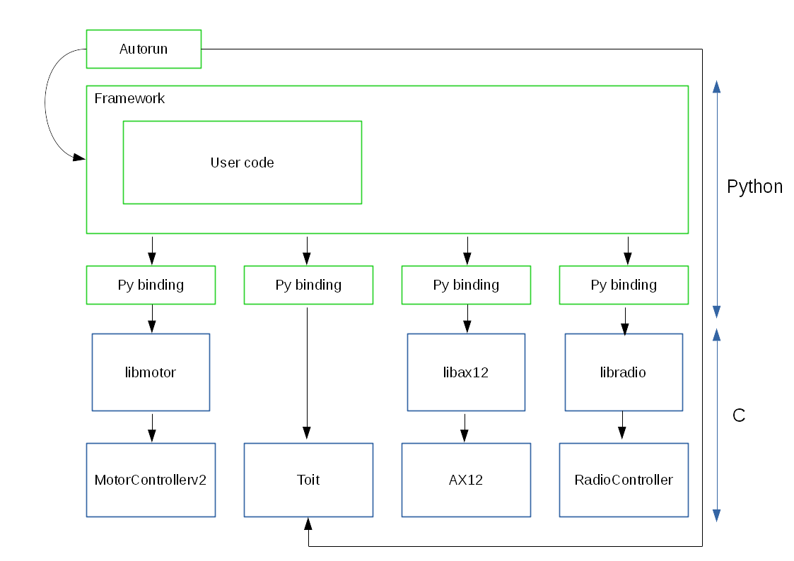

# Robot Framework

This framework is designed to provide a nice environment for programming Telecom Robotics robots.
It's split in several layers:
  - Autorun : a basic program whose role is to start the "main" program if a condition is meant
  - Framework: written in Python, it provides high-level abstraction to be used by user code
  - py binding : a binding in Python to provide clean interface (and maybe some high level functions)
to call low-level C functions.
  - lib layer: C libraries to deal with low-level stuff on the Raspberry-Pi
  - controllers & other: C code to manage specific components.

The following figure shows the organization of these layers:

## MotorControllerv2
This code runs on MotorBoard, which is the PCB board designed at Telecom Robotics to handle all
the low-level stuff related to movements.
It can control
  - Motors
  - Coding wheels
  - IMU
  - RadioController data
